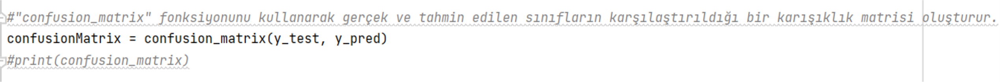
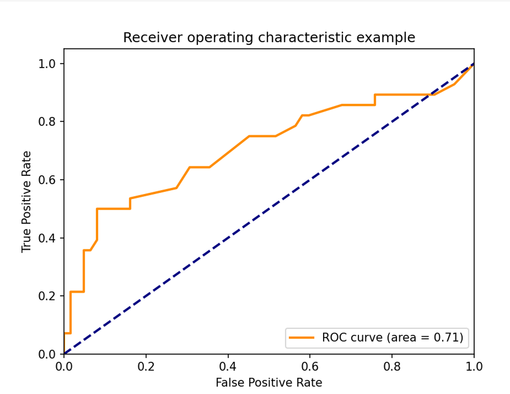

### [En](#naive-bayes-and-bbn)/[Tr](#naive-bayes-ve-bbn)
# NAIVE BAYES VE BBN
## NAIVE BAYES VE BBN YÖNTEMİ: KALP YETMEZLİĞİ SONUCU ÖLÜM TEŞHİSİ
### Mahire Zühal Özdemir
#### Makine öğrenimi ile kalp yetmezliği olan hastaların sağkalım tahmini yapmanın önemi:
Kalp yetmezliği ciddi bir sağlık sorunudur ve hastaların sağkalım oranları birçok faktöre bağlıdır. Makine öğrenimi, hastaların sağkalım tahminleri ve risk faktörlerinin belirlenmesinde etkili bir araçtır. Bu yöntemler, hastalığın daha iyi anlaşılmasına, tedavinin daha iyi yönetilmesine ve hastaların yaşam kalitesinin artırılmasına yardımcı olabilir.
#### Peki eğitim için kullanacağımız Naive Bayes algoritması nedir ve nasıl çalışır?
Naive Bayes algoritması, sınıflandırma problemlerinde kullanılan bir makine öğrenimi algoritmasıdır ve Bayes teoremi temel alınarak çalışır. Algoritma, veri kümesindeki özellikleri analiz eder ve bu özelliklerin hangi sınıfa ait olduğunu tahmin eder. Eğitim verileri üzerinde çalışarak her sınıf için olasılık dağılımlarını hesaplar ve daha sonra test verisi için her bir sınıfın olasılığını hesaplayarak en yüksek olasılığa sahip sınıfı tahmin eder. Naive Bayes algoritması, özellikler arasında herhangi bir ilişki olmadığını varsayar ve her özellik için ayrı ayrı olasılık hesaplar.
#### Naive Bayes algoritması ne tür problemler için kullanılır?
Naive Bayes algoritması, sınıflandırma problemleri içinyaygın olarak kullanılan bir algoritmadır. Özellikle doğal dil işleme, spam filtreleme, duyguanalizi ve tıbbi teşhis gibi alanlarda sıklıkla tercih edilir. Ayrıca, çoklu sınıflandırma ve çok değişkenli sınıflandırma problemleri için de etkilidir. Naive Bayes algoritması, verilerin özelliklerinin bağımsız olduğu ve sınıflandırma için gerekli olan olasılık hesaplamalarının hızlı ve basit bir şekilde yapılabileceği durumlarda tercih edilir.
#### Bayesian Belief Network (BBN) nedir ve nasıl çalışır?
BBN (Bayesian Belief Network), olasılıksal bir modeldir ve belirli bir amaç için farklı olasılık değerlerini hesaplamak için kullanılır. BBN, birçok farklı alanda kullanılabilir, örneğin tıp, finans, endüstriyel süreç kontrolü, su kaynakları yönetimi ve daha birçok alanda.
BBN, olasılık teorisi ve graflar teorisi prensiplerine dayanır. Bir BBN, belirli bir sistem veya olaylar kümesinin belirli bir özellikler setine sahip olduğu durumlarda olasılık değerlerini hesaplamak için kullanılır. Bu özellikler, bir düğüm ağından oluşan bir grafikte temsil edilir. Her düğüm, belirli bir olayı veya özelliği temsil eder ve bu olayların birbirleriyle olan ilişkileri, düğümleri birbirine bağlayan çizgilerle gösterilir. Düğümler, olasılık değerlerinin hesaplandığı yerlerdir ve her bir düğümün bağımsız değişkenleri bulunur.
#### BBN ne tür problemler için kullanılır?
BBN, belirli bir sistem veya olayların olasılık değerlerini hesaplamak için kullanılabilir. Örneğin, bir tıp uzmanı, bir hasta için tanı koymak veya tedavi etmek için bir BBN kullanabilir. BBN, hastanın semptomları, test sonuçları, hastalık geçmişi vb. gibi özellikleri içerir ve bu özelliklerin birbirleriyle olan ilişkileri hesaba katılır. Böylece, bir hastanın belirli bir hastalığı olma olasılığı veya bir tedavinin başarı şansı hesaplanabilir.
#### Kalp Yetmezliği Klinik Kayıtları Veriseti
- yaş: hasta yaşını temsil eder
- cinsiyet: hastanın cinsiyetini temsil eder
- anemi: hasta anemik mi değil mi, 1 (evet) veya 0 (hayır) şeklinde temsil edilir
- yüksek tansiyon: hasta hipertansiyon hastası mı değil mi, 1 (evet) veya 0 (hayır) şeklinde temsil edilir
- bölgesel basınç: hasta kan basıncını temsil eder
- serum kreatinin: hasta serum kreatinin seviyesini temsil eder
- serum sodyum: hasta serum sodyum seviyesini temsil eder
- kalp damarları: hastanın kalp damarlarından muzdarip olup olmadığı, 1 (evet) veya 0 (hayır) şeklinde temsile dilir
- ejeksiyon fraksiyonu: hasta ejeksiyon fraksiyonu yüzdesini temsil eder
- serum kreatinkinazı: hasta serum kreatinkinazı seviyesini temsil eder
- sigara kullanımı: hasta sigara içiyor mu, 1 (evet) veya 0 (hayır) şeklinde temsil edilir
- ölüm: hasta öldü mü, 1 (evet) veya 0 (hayır) şeklinde temsil edilir
Bu veriseti, kalp yetmezliği olan hastalarıns ağkalım tahmini yapmak için kullanılabilir.
#### Naive Bayes Python Kodu
 &nbsp;&nbsp;&nbsp; 
 &nbsp;&nbsp;&nbsp; 
&nbsp;&nbsp;&nbsp;
&nbsp;&nbsp;&nbsp;
&nbsp;&nbsp;&nbsp;
&nbsp;&nbsp;&nbsp;

#### Sonuç

&nbsp;&nbsp;&nbsp;
&nbsp;&nbsp;&nbsp;

#### Bayesian Belief Network Kod

&nbsp;&nbsp;&nbsp;

&nbsp;&nbsp;&nbsp;

&nbsp;&nbsp;&nbsp;

&nbsp;&nbsp;&nbsp;

#### "Makine öğrenimi, kalp yetmezliği olan hastaların sağkalımını yalnızca serum kreatinin ve ejeksiyon fraksiyonundan tahmin edebilir" adlı akademik çalışma:
Bu akademik çalışmada , ilk olarak tüm veri seti üzerinde sağkalım tahmini için elde edilen sonuçlar ,özellik sıralaması için elde edilen sonuçlar ve veri setinin yalnızca en önemli iki özelliği kullanıldığında sağkalım tahmini ile ilgili sonuçlar açıklanmıştır. Ardından, her bir hastanın takip süresinin sağkalım tahminine ve özellik sıralamasına dahil edilmesiyle elde edilen sonuçları rapor ediliyor.
#### Sonuç
Bu çalışmada, geleneksel biyoistatistik analiz yöntemleriyle belirlenen iki özelliğin (ejeksiyon fraksiyonu ve serum kreatin) makine öğrenimi yöntemleriyle sıralanması yapılmıştır. Bu yöntem, elektronik sağlık kayıtlarının kardiyovasküler kalp hastalığı olan hastaların ikili sınıflandırılmasında etkili bir şekilde kullanılabileceğini göstermiştir.
Ancak, çalışmanın sınırlamaları arasında veri setinin küçük boyutu (299 hasta), hastaların fiziksel özellikleri hakkında yetersiz bilgi ve farklı coğrafi bölgelerden gelen veri setleri olmaması yer almaktadır. Bu sınırlamalar daha büyük ve çeşitli veri setleri kullanarak daha güvenilir sonuçlar elde edilebileceğini ve ek risk faktörlerinin tespit edilebileceğini göstermektedir.

# NAIVE BAYES AND BBN
## NAIVE BAYES AND BBN METHOD: DIAGNOSIS OF DEATH DUE TO HEART FAILURE
### Mahire Zühal Özdemir
#### The importance of predicting survival of patients with heart failure using machine learning:
Heart failure is a serious health problem and patient survival rates depend on many factors. Machine learning is an effective tool for predicting patient survival and identifying risk factors. These methods can help to better understand the disease, better manage treatment and improve patients' quality of life.
#### So what is the Naive Bayes algorithm we will use for training and how does it work?
The Naive Bayes algorithm is a machine learning algorithm used in classification problems and works based on Bayes theorem. The algorithm analyzes the features in the dataset and predicts which class these features belong to. It calculates probability distributions for each class by working on training data and then predicts the class with the highest probability by calculating the probability of each class for the test data. The Naive Bayes algorithm assumes that there is no relationship between features and calculates the probability for each feature separately.
#### What kind of problems is the Naive Bayes algorithm used for?
Naive Bayes algorithm is a widely used algorithm for classification problems. It is especially preferred in areas such as natural language processing, spam filtering, sentiment analysis and medical diagnosis. It is also effective for multi-classification and multivariate classification problems. Naive Bayes algorithm is preferred when the properties of the data are independent and the probability calculations required for classification can be done quickly and simply.
#### What is a Bayesian Belief Network (BBN) and how does it work?
A BBN (Bayesian Belief Network) is a probabilistic model and is used to calculate different probability values for a specific purpose. BBN can be used in many different fields, for example in medicine, finance, industrial process control, water resources management and many more.
A BBN is based on the principles of probability theory and graph theory. A BBN is used to calculate probability values when a given system or set of events has a certain set of properties. These properties are represented in a graph consisting of a network of nodes. Each node represents a particular event or property, and the relationships of these events to each other are represented by lines connecting the nodes. The nodes are where probability values are calculated and each node has independent variables.
#### What kind of problems is a BBN used for?
A BBN can be used to calculate probability values for a given system or events. For example, a medical professional might use a BBN to diagnose or treat a patient. The BBN includes features such as the patient's symptoms, test results, disease history, etc. and takes into account the relationships between these features. Thus, the probability of a patient having a particular disease or the chances of success of a treatment can be calculated.
#### Heart Failure Clinical Registries Dataset
- Age: represents the age of the patient
- gender: represents the sex of the patient
- anemia: is the patient anemic or not, represented as 1 (yes) or 0 (no)
- high blood pressure: whether the patient suffers from hypertension or not, represented as 1 (yes) or 0 (no)
- regional pressure: represents patient blood pressure
- serum creatinine: represents patient serum creatinine level
- serum sodium: represents patient serum sodium level
- heart vessels: whether the patient suffers from cardiovascular disease, represented as 1 (yes) or 0 (no)
- ejection fraction: represents the percentage of patient ejection fraction
- serum creatinkinase: represents patient serum creatinkinase level
- use of cigarettes: does the patient smoke, represented as 1 (yes) or 0 (no)
- death: did the patient die, represented as 1 (yes) or 0 (no)
This dataset can be used to predict the survival of patients with heart failure.

#### Naive Bayes Python Code
 &nbsp;&nbsp;&nbsp; 
 &nbsp;&nbsp;&nbsp; 
&nbsp;&nbsp;&nbsp;
&nbsp;&nbsp;&nbsp;
&nbsp;&nbsp;&nbsp;
&nbsp;&nbsp;&nbsp;

#### Conclusion

&nbsp;&nbsp;&nbsp;
&nbsp;&nbsp;&nbsp;

#### Bayesian Belief Network Code

&nbsp;&nbsp;&nbsp;
&nbsp;&nbsp;&nbsp;
&nbsp;&nbsp;&nbsp;
&nbsp;&nbsp;&nbsp;

#### "Machine learning can predict survival of patients with heart failure from serum creatinine and ejection fraction alone":

In this academic study, we first describe the results obtained for survival prediction on the whole dataset, the results obtained for feature ranking, and the results on survival prediction when only the two most important features of the dataset are used. Then, we report the results obtained by including the follow-up time of each patient in the survival prediction and feature ranking.

#### Result

In this study, two features (ejection fraction and serum creatine) determined by traditional biostatistical analysis methods were ranked using machine learning methods. This method demonstrated that electronic health records can be effectively used for binary classification of patients with cardiovascular heart disease.
However, limitations of the study include the small size of the dataset (299 patients), insufficient information on patients' physical characteristics, and the lack of datasets from different geographical regions. These limitations suggest that more reliable results can be obtained and additional risk factors can be identified by using larger and more diverse datasets.

